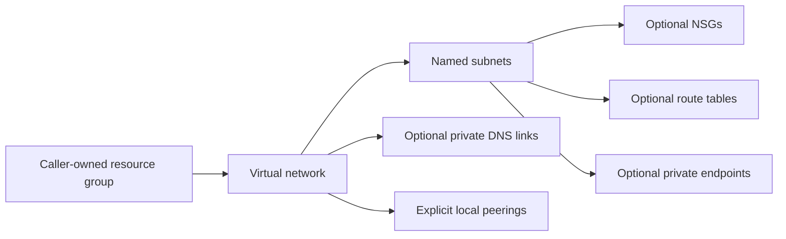

# Azure network foundation module

Compose an Azure virtual network, named subnets, optional NSGs and route tables, private DNS, local peering links and private endpoints. This is a reusable module: the caller owns the resource group, provider authentication and Terraform state.

Designed from the networking patterns in the original AZ-TF-MOD-azvdc project, with explicit inputs replacing environment-specific lookups. This is a new API and resource layout, not an in-place upgrade.

## Architecture



## Start here

See [the basic example](examples/basic/main.tf) for a complete caller. Authenticate only for a real deployment; credential-free checks are:

```sh
terraform init -backend=false
terraform fmt -check -recursive
terraform validate
terraform test
```

Tests mock Azure and include both isolated composition checks and a full child-module integration test. Child modules have their own resource and input tests. This does not prove live Azure deployment, routing, DNS resolution or private endpoint approval.

## Inputs and ownership

Required: `name`, `resource_group_name`, `location`, `address_space`.
Optional: `subnets`, `tags`, `dns_servers`, `ddos_protection_plan_id`, `log_analytics_workspace_id`, `private_dns_zones`, `peerings`, `private_endpoints`.
[variables.tf](variables.tf) defines every type and default. [outputs.tf](outputs.tf) exports stable ID maps.

- Subnet map keys are the exact Azure names. CIDRs are explicit and are never derived from list position. Use the subnet module for the full rules, routes and delegation schema.
- Existing resource group, DDoS plan and Log Analytics workspace are supplied by ID/name. Nothing discovers another environment's Terraform state.
- A peering entry creates only this VNet's side. Create the reciprocal side separately and configure remote gateway use only after a gateway exists. Supply triggers = { remote_address_space = join(",", remote_cidrs) } to resync the peering when a remote network is resized; otherwise the remote owner must trigger a peering sync explicitly. Avoid passing mutually dependent module outputs into both modules; create reciprocal peering resources after both networks instead.
- Private DNS zones are created here and linked without auto-registration. Central DNS ownership across multiple VNets should be managed separately, not duplicated.
- A private endpoint refers to an existing target resource and a subnet in this module. DNS groups may reference only zones owned here. Set is_manual_connection and an optional request_message when the target owner must approve the connection. Service-side approval, DNS design and access permissions remain deployment responsibilities.
- Subnets default to explicit outbound connectivity: configure a NAT Gateway, firewall or other intended egress route if workloads need outbound internet. This module does not create one.

## Scope and migration

Public DNS/records, ACR, firewalls, gateways, NAT and subscription bootstrap belong to separate stacks. No region aliases, tenant IDs, credentials, CSV discovery, destructive helper scripts or old Git history are included.

For an existing estate, first inventory state/resource addresses and prepare reviewed `moved` blocks or imports in a dedicated migration. Do not point this example at existing state and apply: changed names and addresses may replace resources. This repository makes no compatibility promise with the legacy state layout.

Version constraints describe the supported API family; the lockfile records the provider tested by CI. Dependency updates must pass tests before release. See [CONTRIBUTING.md](CONTRIBUTING.md).
